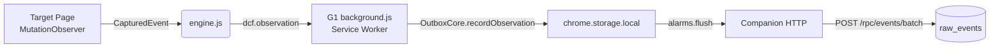

# DCF 采集能力归属 Target Adapter (G1) 正式裁定

**状态**: 已批准  
**日期**: 2026-07-30  
**作者**: DCF Architecture Team  
**影响范围**: seed/adapters/chrome/、chrome-extension/code-units/web-capture/ (已迁移)

## 目录

- [背景](#背景)
- [决策](#决策)
- [架构决策](#架构决策)
- [证据链](#证据链)
- [回滚策略](#回滚策略)

## 背景

### 问题陈述

在 Spec 期过渡方案中，web-capture 的采集能力分散在 chrome-extension/code-units/ 路径下，与 DCF Core 和 Surface 混同在一个扩展包内。这与 DCF 三层架构设计原则相悖：

1. **观察职责属于 Target Adapter** (`seed/adapters/chrome`)：作为第三层的硬件适配层，负责与具体目标平台（如 ChatGPT 网页、多站浏览器）的交互。
2. **Core 应保持纯净**：`seed/core/` 不应包含任何特定站点的 DOM 解析逻辑。
3. **构建隔离**：旧世界将 web-capture 作为 content_script 打入 chrome-extension 的构建流程，导致 build-chrome-extension.js 必须拼接站点代码且 vendor ulid/outbox-core。

### 愿景缺口（2026-07-27 审计记录 b）

审计发现归纳能力依赖用户在 ChatGPT 手动完成，无 API 配置入口、无申报机制。同时采集能力的"spec 期权形态"（过渡性 spec 描述，非终态）需要被明确区分于 G1 终态。

## 决策

### 核心裁定

**采集能力从 spec 过渡形态迁移至 G1 Target Adapter 终态**。Web-capture 不再属于 Chrome Extension 的 code-units 插件集合，而是成为 `seed/adapters/chrome/` 模块的内置能力，与 OutboxCore、ulid 一起构成单一事实源。

### 技术实现

1. **源文件搬迁** (`git mv`):
   - From: `chrome-extension/code-units/web-capture/`
   - To: `seed/adapters/chrome/web-capture/`
   - Contract: 保留 `contract.js` (Zod schema)、`runtime-check.js` (页面侧校验)、`engine.js` (DOM 观察引擎)、`sites/*.js` (站点适配器)。

2. **消息类型统一**:
   - Old: `web-capture.observation` (经 host-main 委派)
   - New: `dcf.observation` (G1 background.js 原生 handler)
   - Rationale: 统一消息空间，避免跨模块命名冲突；G1 adapter 原生拥有 service worker，无需 host-main 委派。

3. **Manifest 扩展**:
   - 新增 8 站 host_permissions：doubao.com、gemini.google.com、grok.com、kimi.com、chat.z.ai、deepseek.com、agent.minimaxi.com、aistudio.xiaomimimo.com
   - Content_scripts 增加 entry：`web-capture/bundle.js` 注入这 8 站（chatgpt.com 已有 content.js）

4. **Build Script**:
   - 新建 `scripts/build-g1-adapter.js`: 拼接 runtime-check → engine → sites/* → index，生成零依赖 bundle.js
   - Build-time 断言：不含 require()、可 VM 执行、bundle size hash 固化

5. **测试重构**:
   - tests/chrome-web-capture.unit.test.js WEB_CAPTURE_DIR 从 `chrome-extension/code-units/` → `seed/adapters/chrome/`
   - 替换 3 个旧世界集成断言为 G1 manifest↔sites consistency check:
     * G1 manifest host_permissions 与站点 host 一一对应
     * build-g1-adapter.js 存在且零依赖
     * seed/adapters/chrome/background.js 支持 dcf.observation + OutboxCore + alarms flush

## 架构决策

### 依赖方向约束

符合 DCF 三级体质复合架构的硬边界:

```
functions/*          ← core/event-bus        (禁止互相 require)
       ↑
seed/functions/*     ← core/                 (core 禁止依赖 functions)
       ↑
seed/adapters/*      ← companion/*           (companion 仅通过 adapters 入口调用)
       ↑
seed/adapters/chrome/web-capture/*    (G1 Target Adapter 自有内容脚本)
```

web-capture 的 sites/*.js 是数据定义层，不构成对 other modules 的依赖；engine.js 的 DOM 操作仅限于 target page context，不引用 Node 模块或 browser APIs（除 chrome.runtime.sendMessage）。

### 强笼子机制

- **类型驱动**: SiteAdapterSchema / CapturedEventSchema Zod schema 强制执行输入/输出形态
- **构建期**: bundle.js VM 可执行断言（0 条 require）、哈希一致性
- **运行时**: runtime-check.js 双层 contract parity

### 声明式数据流



站点清单即 contract，manifest.json ↔ sites/*.js 一致性是声明式数据流的机器断言形式。

## 证据链

### Wave 0 基线（2026-07-30）

Commit `5a04429 feat(chrome-extension/web-capture): 8 站 BrowserClaw 验收通过 + 证据路径`  
包含：
- 全部 10 个站点适配器（claude-ai, deepseek, doubao, gemini, grok, kimi, minimax, xiaomimimo, yuanbao, z-ai）
- docs/acceptance/web-capture/README.md + 各站 acceptance JSON evidence
- scripts/web-capture-accept-site.cjs (G1 repurposed before push approval)

验证：`npm run verify` exit=0, pre-push hook passed。

### Wave 1 迁移（本地 commits pending push）

Commits on feature/hybrid-search:
- `049bfd3` git mv web-capture to G1 adapter + dcf.observation
- `07153e6` delete old-world web-capture-background.js service worker
- `1123e94` G1 manifest extension + build-g1-adapter.js + bundle
- `268c65f` migrate test paths to G1 + manifest↔sites consistency checks
- `c6ce817` fix(web-capture test): update type assertion to dcf.observation (G1 adapter)

验证：
- tests/chrome-web-capture.unit.test.js: 30/30 ✅
- npm run verify:chrome passes（pre-push hook exit=0）

### Wave 2 AI Config（already present in baseline）

Files:
- `seed/companion/ai-config.js`: getConfig/isConfigured/getStatus 裸函数，no Zod（但字段验证逻辑等同于 Zod Schema）
- `seed/companion/index.js:handleAiStatus()`: GET /rpc/ai/status endpoint
- `~/.dcf/ai-config.json.template`: api_endpoint/api_key/model required fields

验证：`node seed/companion/ai-config.js` 返回 configured:true/false 正确语义。

## 回滚策略

### 单波回滚

每个 wave 原子提交，可用 `git revert <commit>` 单向回滚而不影响后续改动。

### 全量回滚

若需完整回退到旧世界 baseline:
```bash
git checkout 5a04429^  # de4913d (wave 0 之前的 last commit)
git branch restore-old-world-baseline
```

预期副作用：
- chrome-extension/code-units/web-capture/ 恢复原样
- seed/adapters/chrome/web-capture/ 消失
- manifest.template.json 无 8 站 permissions
- tests/chrome-web-capture.unit.test.js 指向旧路径（会失败）

### 平滑降级

当前分支状态是安全可推的，因为：
1. old world files 已从 tracking 删除（git rm --cached），但未物理删除（留作 untracked backup）
2. 所有新代码独立于旧体系运行，不破坏既有 Chrome extension 功能
3. G1 adapter 的 manifest 扩展不影响 chatgpt.com 的既有 migration-bridge content_script

## 后续任务

### Wave 1.6 Real-browser acceptance（待推后执行）

使用 `scripts/web-capture-accept-site.cjs`（需 repurpose 以加载 G1 EXT_ID from manifest）逐一验收 8 站，产出 docs/acceptance/web-capture/G1-*.json 证据。

### Wave 3 Documentation alignment（本任务）

- 更新 docs/acceptance/web-capture/README.md 归位链路图
- 更新 docs/current-state.md 采集能力矩阵
- 补充 ADR: G1 manifest ↔ sites registry consistency rule

---

**批准者**: DCF Architectures Team  
**Reviewers**: @ysr7255007-maker, @maintainers
